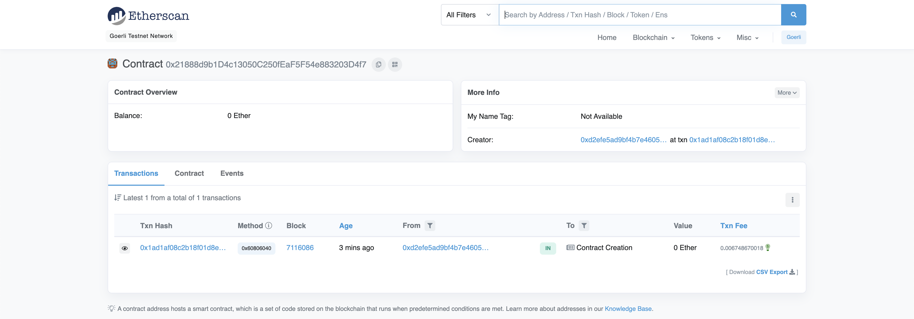

# Deploying a smart contract to the Ethereum Network using Alchemy and Hardhat

This guide will walk you through the steps to create and deploy an [ERC721 token](https://ethereum.org/en/developers/docs/standards/tokens/erc-721/) smart contract to the [Goerli Ethereum test network](https://ethereum.org/en/developers/docs/networks/) using the [Alchemy](https://docs.alchemy.com/alchemy/) and [Hardhat](https://hardhat.org/getting-started) development environments.

While we will be writing code in TypeScript and Solidity, prior coding knowledge in these languages is not strictly required, however an understanding of navigating your computer's file system using the [command line](https://en.wikipedia.org/wiki/Command-line_interface) and some experience with [Git](https://git-scm.com/doc) would make following the process easier.

That said, the steps are designed to be kept as clear and straightforward as possible.

Please make sure you have met the requirements before getting started (see embedded links), and some [additional resources](#additional-resources) have been provided at the end for you to take a deeper dive.

Let's go!

> ## ✅ Requirements
>
> -   [Free Alchemy account](https://www.alchemy.com/) with an API key to communicate with the Ethereum Network.
> -   [MetaMask](https://metamask.io/download.html) wallet to provide a private key and send transactions
> -   [Node.js](https://nodejs.org/en/download/) to run code and download dependencies
> -   Text editor or IDE such as [Visual Studio Code](https://code.visualstudio.com/Download)
> -   [Git](https://git-scm.com/downloads) version control

## Initial setup (from Terminal)

-   verify that you have Node installed:

```bash
$ node --version
<v12.x-or-higher>
```

-   create an empty directory and navigate to it:

```bash
$ mkdir new-nft
$ cd new-nft
```

-   initialize a new Node package using [npm](https://docs.npmjs.com//):

```bash
$ npm init -y
Wrote to <path-to-package>/new-nft/package.json:

{
  "name": "new-nft",
  "version": "1.0.0",
  "description": "",
  "main": "index.js",
  "scripts": {
    "test": "echo \"Error: no test specified\" && exit 1"
  },
  "keywords": [],
  "author": "",
  "license": "ISC"
}
```

-   install Hardhat as a development dependency:

```bash
$ npm install --save-dev hardhat
```

-   configure Hardhat (select **Create an empty hardhat.config.js**):

```
$ npx hardhat
888    888                      888 888               888
888    888                      888 888               888
888    888                      888 888               888
8888888888  8888b.  888d888 .d88888 88888b.   8888b.  888888
888    888     "88b 888P"  d88" 888 888 "88b     "88b 888
888    888 .d888888 888    888  888 888  888 .d888888 888
888    888 888  888 888    Y88b 888 888  888 888  888 Y88b.
888    888 "Y888888 888     "Y88888 888  888 "Y888888  "Y888

👷 Welcome to Hardhat v2.9.9 👷‍

? What do you want to do? …
  Create a basic sample project
  Create an advanced sample project
  Create an advanced sample project that uses TypeScript
❯ Create an empty hardhat.config.js
  Quit
```

Terminal output:

```
✔ What do you want to do? · Create an empty hardhat.config.js
✨ Config file created ✨
```

-   create directories for the contract and deployment source code files:

```bash
$ mkdir contracts scripts
```

-   initialize a Git repository:

```bash
$ git init
Initialized empty Git repository in <path-to-package>/new-nft/.git/
```

-   confirm the project file structure:

```bash
$ ls -a
.			    .git			    hardhat.config.js	        package-lock.json	        scripts
..			    contracts		    node_modules		        package.json
```

-   open the project directory with Visual Studio Code:

```bash
$ code .
```

## Write and compile the contract

### Terminal

-   install [OpenZeppelin's contracts](https://github.com/OpenZeppelin/openzeppelin-contracts), from which `NewNFT` will inherit:

```bash
$ npm install --save-dev @openzeppelin/contracts
```

-   create the contract source code file (`NewNFT.sol`) in the project's `contracts` directory:

### `contracts/NewNFT.sol`

```javascript
// specify a license for use and distribution of your contract (as a comment)
// SPDX-License-Identifier: MIT

// specify a Solidity pragma to enable compiler features and checks
pragma solidity ^0.8.15;

// import OpenZeppelin's ERC721 token contract and two other contracts
import "@openzeppelin/contracts/token/ERC721/ERC721.sol";
import "@openzeppelin/contracts/access/Ownable.sol"; // to control ownership
import "@openzeppelin/contracts/utils/Counters.sol"; // to keep track of tokens minted

// implement the ERC721 contract provided by OpenZeppelin and the `onlyOwner` modifier
contract NewNFT is ERC721, Ownable {
    using Counters for Counters.Counter;

    // define total number of tokens mintable
    uint256 public constant TOTAL_SUPPLY = 10_000;

    // set price to mint a new token
    uint256 public constant MINT_PRICE = 2_000;

    // keep track of the number of tokens minted
    Counters.Counter private _tokenIdCounter;

    // set the name and symbol of your new token
    constructor() ERC721("NewNFT", "NFT") {}

    function safeMint(address to) public payable onlyOwner {
        // set the current tokenId
        uint256 tokenId = _tokenIdCounter.current();

        // perform checks
        require(tokenId < TOTAL_SUPPLY, "Max supply reached");
        require(
            msg.value == MINT_PRICE,
            "Transaction value did not equal the mint price"
        );

        // increment tokenId counter
        _tokenIdCounter.increment();

        // a new token to the `to` address
        _safeMint(to, tokenId);
    }
}

```

-   edit the Solidity compiler version in the Hardhat configuration JavaScript file (in the root directory) to match the contract pragma:

### `hardhat.config.js`

```javascript
/**
 * @type import('hardhat/config').HardhatUserConfig
 */
module.exports = {
    solidity: "0.8.15",
};
```

### Terminal

-   compile your first Solidity smart contract using Hardhat!

```bash
$ npx hardhat compile
Solidity 0.8.15 is not fully supported yet. You can still use Hardhat, but some features, like stack traces, might not work correctly.

Learn more at https://hardhat.org/reference/solidity-support

Compiled 12 Solidity files successfully
```

## Connect Alchemy and MetaMask

-   [create an Ethereum API key with Alchemy](https://www.youtube.com/watch?v=tfggWxfG9o0)
-   [export your MetaMask account's private key](https://metamask.zendesk.com/hc/en-us/articles/360015289632-How-to-Export-an-Account-Private-Key)
-   [get some ETH from the Goerli faucet to pay for the transaction](https://goerlifaucet.com/)

### Terminal

-   install the [dotenv](https://www.npmjs.com/package/dotenv) package to handle environment variables:

```bash
$ npm install dotenv --save
```

-   create a new `.env` file in the root directory to store your environment variables as strings:

### `.env`

```
ALCHEMY_API_KEY = "<your-api-key>"
ETH_PRIVATE_KEY = "<your-private-key>"
```

-   create a new `env.d.ts` file in the root directory to specify types for your environment variables:

### `env.d.ts`

```typescript
declare namespace NodeJS {
    export interface ProcessEnv {
        ALCHEMY_API_KEY: string;
        ETH_PRIVATE_KEY: string;
    }
}
```

## Commit changes to Git

-   edit `.gitignore` (in the root directory) to exclude certain items from being tracked by Git:

> 🚧 **WARNING**
>
> `.env` contains your MetaMask wallet private key, so make sure you add it to`.gitignore` if your repo is public!

### `.gitignore`

```
node_modules
.env
artifacts
cache
package-lock.json
```

### Terminal

-   stage the changes:

```bash
$ git add .
$ git status
On branch main

No commits yet

Changes to be committed:
  (use "git rm --cached <file>..." to unstage)
        new file:   .gitignore
        new file:   contracts/NewNFT.sol
        new file:   env.d.ts
        new file:   hardhat.config.js
        new file:   package.json
```

-   commit the changes with a message:

```bash
$ git commit -m "initial commit"
[main (root-commit) dcdfa47] initial commit
 5 files changed, 81 insertions(+)
 create mode 100644 .gitignore
 create mode 100644 contracts/NewNFT.sol
 create mode 100644 env.d.ts
 create mode 100644 hardhat.config.js
 create mode 100644 package.json
```

-   check to see everything is in order:

```bash
$ git status
On branch main
nothing to commit, working tree clean
```

## Deployment setup and TypeScript support

### Terminal

-   install [Ethers](https://www.npmjs.com/package/ethers) to interact with the [Ethereum Network](https://ethereum.org/en/developers/docs/networks/):

```bash
$ npm install --save-dev @nomiclabs/hardhat-ethers ethers
```

-   install [ts-node](https://www.npmjs.com/package/ts-node) and the [TypeScript compiler](https://www.npmjs.com/package/typescript) so that you can run TypeScript code:

```bash
$ npm install --save-dev ts-node typescript
```

-   install [TypeChain](https://github.com/dethcrypto/TypeChain/tree/master/packages/hardhat) for type-checking support:

```bash
$ npm install --save-dev typechain @typechain/hardhat @typechain/ethers-v5
```

-   change the file extension of `hardhat.config.js` from `.js` (JavaScript) to `.ts` (TypeScript):

```bash
$ mv hardhat.config.js hardhat.config.ts
```

-   edit `hardhat.config.ts` and export a new Hardhat configuration:

### `hardhat.config.ts`

```typescript
import { HardhatUserConfig } from "hardhat/config";
import "dotenv/config";
import "@nomiclabs/hardhat-ethers";
import "@typechain/hardhat";

// define Solidity compiler version and network configuration information
// to deploy to the Ethereum mainnet or any other network,
// simply add a new `networks` field with the necessary data
const config: HardhatUserConfig = {
    solidity: "0.8.15",
    defaultNetwork: "goerli",
    networks: {
        goerli: {
            url: `https://eth-goerli.alchemyapi.io/v2/${process.env.ALCHEMY_API_KEY}`,
            accounts: [`0x${process.env.ETH_PRIVATE_KEY}`],
        },
    },
};

export default config;
```

-   create a new TypeScript configuration file (`tsconfig.json`) in the root directory:

### `tsconfig.json`

```json
{
    "compilerOptions": {
        "target": "es2018",
        "module": "commonjs",
        "strict": true,
        "esModuleInterop": true,
        "outDir": "dist"
    },
    "include": ["./scripts", "./typechain-types"],
    "files": ["./hardhat.config.ts"]
}
```

### Terminal

-   check that the code still works:

```bash
$ npx hardhat compile
Solidity 0.8.15 is not fully supported yet. You can still use Hardhat, but some features, like stack traces, might not work correctly.

Learn more at https://hardhat.org/reference/solidity-support

Nothing to compile
No need to generate any newer typings.
```

## Deploy the contract

-   create a new `deploy.ts` file in the project's `scripts` directory:

### `scripts/deploy.ts`

```typescript
// import necessary libraries for deployment
// Ethers provides a list of private keys to sign transactions
import { run, ethers } from "hardhat";

async function main() {
    await run("compile"); // first compile the contract

    // get our account (as deployer) to verify that a minimum wallet balance is available
    const accounts = await ethers.getSigners();

    // print deployer address and balance
    accounts.forEach(async function (deployer) {
        console.log(
            `Deploying contracts with the account: ${deployer.address}`
        );

        console.log(
            `Account balance: ${(await deployer.getBalance()).toString()}`
        );
    });

    // fetch the compiled contract using ethers.js
    const NFT = await ethers.getContractFactory("NewNFT");

    // create an instance of our NFT
    const nft = await NFT.deploy();

    // print the contract address
    console.log(`Contract deployed to address: ${nft.address}`);
}

main()
    .then(() => process.exit(0))
    .catch((error) => {
        console.error(error);
        process.exit(1);
    });
```

### Terminal

-   deploy the contract:

```bash
$ npx hardhat run scripts/deploy.ts --network goerli
Nothing to compile
No need to generate any newer typings.
Deploying contracts with the account: <your-public-key>
Account balance: <your-account-balance>
Contract deployed to address: <contract-address>
```

And there you go! You have successfully deployed your first smart contract to an Ethereum test network!

Go to [Goerli Etherscan](https://goerli.etherscan.io/) to see your transaction by copying the contract address from Terminal and pasting it into the search bar.

You should see something like this:



## Additional resources

-   [Command line commands](https://www.codecademy.com/article/command-line-commands)
-   [Git Handbook](https://guides.github.com/introduction/git-handbook/)
-   [Exclude node_modules folder with .gitignore file](https://sebhastian.com/git-ignore-node_modules/)
-   [OpenZeppelin ERC721 token API](https://docs.openzeppelin.com/contracts/4.x/erc721)
-   [Ethers docs](https://docs.ethers.io/v5/)
-   [Ethereum transactions](https://ethereum.org/en/developers/docs/transactions/)
-   [Ethereum Community Guides and Resources](https://ethereum.org/en/learn/)
-   [What is a non-fungible token?](https://ethereum.org/en/developers/docs/standards/tokens/erc-721/)
-   [Choosing a network](https://docs.alchemy.com/alchemy/guides/choosing-a-network)
-   [Consensys' Ethereum Smart Contract Security Best Practices](https://consensys.github.io/smart-contract-best-practices/)
-   [SPDX licenses](https://spdx.org/licenses/)
